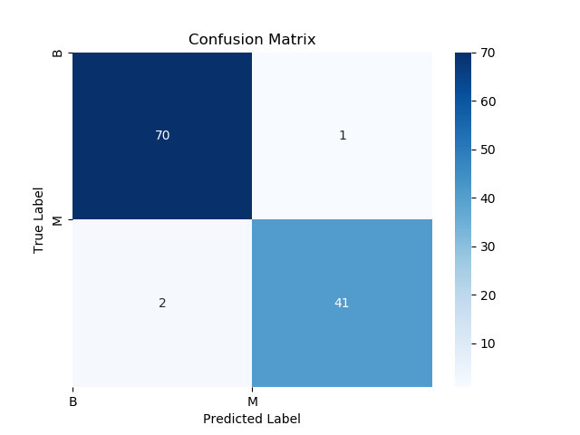
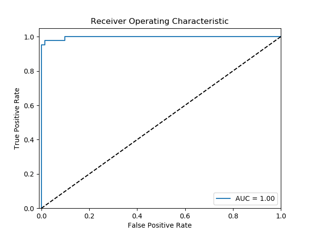

# Project Evaluation Report
In this project, we evaluated the performance of our model using various evaluation metrics. The confusion matrix provides insights into the model's predictive accuracy for each class. The classification report gives a detailed breakdown of precision, recall, and F1-score for each class. Finally, the ROC curve visualizes the model's performance in terms of the true positive rate and false positive rate.

To regenerate the evaluation metrics and plots, run the `model.py` script.

---
## Classification Report
 A text file containing the classification report, which includes precision, recall, F1-score, and support for each class.

Accuracy of our model: 0.9736842105

|               | Precision | Recall | F1-Score | Support |
|-------------- |-----------|--------|----------|---------|
| 0 (Benign)    |   0.97    |  0.99  |   0.98   |    71   |
| 1 (Malicious) |   0.98    |  0.95  |   0.96   |    43   |
|-------------- |-----------|--------|----------|---------|
|   Accuracy    |    -      |   -    |    -     |   114   |
|Macro Average  |   0.97    |  0.97  |   0.97   |   114   |
|Weighted Avg   |   0.97    |  0.97  |   0.97   |   114   |

--- 

## Confusion Matrix
A visual representation of the confusion matrix, summarizing the model's predictions and the actual labels.

## ROC Curve

A visual representation of the ROC curve, showing the trade-off between the true positive rate and false positive rate.

